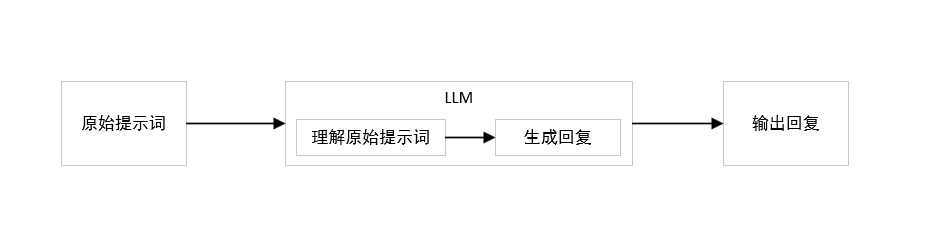
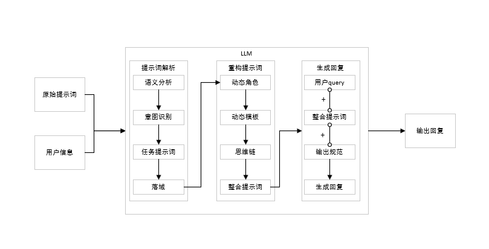

# 一、 什么是提示词重构优化

工业生产在电力支持下驱动器分布在生产流水线各处为生产提供动能，智能生产在算力支撑下大模型分布业务流各处提供智能。

在一个由电源、电线、电阻、开关、灯泡组成的电力系统中，电源稳定不变，调节电阻可以调节灯泡亮度。AI时代，大模型是电源，那么提示词就是电阻，调整提示词获得不同效果。

提示词好坏影响大模型表现的智能程度。数据、算法、算力等资源对普通人属于遥远的存在；获得优秀的AI结果，可掌控且高效成本低廉甚至无成本的提示词是中小企业乃至普通人最好的选择。

提示词重构优化是将不同领域用户的提示词进行重构优化，优化后的提示词更专业、更全面、更准确，
即个性化较强、专业性较强、考虑更全面、更符合用户需求的准确是本项目目标。

# 二、 为什么提示词重构优化？
## 1. 提示词重构优化是提升大模型表现效果的关键。

在人工智能的复杂体系中，大模型的表现取决于诸多因素，而提示词作为人机交互的重要指令引导，其重构优化直接作用于模型的输出质量。

精准且巧妙设计的提示词能够引导模型深入理解任务意图，挖掘数据中的关键信息，从而在各种应用场景下，如内容创作、知识问答、数据分析等，生成更具针对性、逻辑性和深度的回答或结果，有效提升模型在准确性、完整性以及相关性方面的表现，使其在众多任务中展现出更高的智能水平。

## 2. 成本低，为企业部署降低成本。

与大规模的硬件升级、复杂的算法重新研发或海量数据的重新采集与标注相比，提示词重构优化主要聚焦于对交互指令的精细化调整。

企业无需投入大量资金用于扩充计算资源或进行深度的模型架构改造，仅通过对提示词的精心设计与优化，就能显著提升模型的实用性和有效性。这不仅减少了在基础设施建设和技术研发方面的资本支出，还能在人力成本上实现优化，因为不需要过多专业人员进行复杂且耗时的底层技术维护与开发工作，让企业可以以较低的成本快速提升大模型在实际业务中的应用效益，在竞争激烈的市场环境中更具经济优势。 

## 3. 能够提高模型的准确性与可靠性，使其输出更贴合用户预期，减少错误或模糊不清的回应。

例如在自然语言处理任务中，精准的提示词优化可让模型对文本的理解与生成更为精准，无论是撰写文章、回答问题还是进行文本翻译，都能展现出更高的水准。

## 4. 有助于增强模型的适应性与灵活性。

面对不同领域、不同场景以及各种复杂多变的用户需求时，经过重构优化的提示词可以引导模型快速调整策略，更好地应对多样化任务，从专业的科学研究辅助到日常的生活咨询服务，都能游刃有余地发挥作用。

## 5. 利于提升模型的交互性与用户体验。

通过优化提示词，可以让模型与用户之间的对话更加流畅自然，仿佛与一位善解人意、知识渊博的伙伴交流，从而提高用户对模型应用的满意度和忠诚度，促进其在更广泛人群和业务场景中的推广与应用。

## 6. 可以挖掘模型更深层次的潜力，激发其在创新应用方面的可能性。
当提示词以更科学合理的方式重构后，可能会引导模型产生一些前所未有的思路与创意，为解决复杂问题或开拓新的业务方向提供新颖的视角和方法，助力企业与个人在创新之路上迈出更大步伐。 

# 三、 重构优化的目标

个性化、专业性、全面性、准确性是重构优化的四大目标。

## 1. 个性化
人生而不同，所思所想不尽相同。

不同用户需求不同，满足用户个性化需求的同时保持一定的专业、全面、精准。
写代码、写文案是完全不同的提示词，对应的专业人员所需要的专业提示词大不相同。
* 写代码 
  * 一位前端工程师需要写代码，那么前端工程师的专业提示词可能是从页面样式、功能等角度出发。 
  * 页面样式不仅要求大模型遵守前端代码规范（html规范、css规范、js规范）、框架规范（react框架、vue框架等），还会要求大模型遵守美术设计规范，涵盖布局遵循栅格与平衡留白、色彩搭配协调且表意一致、图标简洁统一适配、 文字字体字号适宜可读、图片优质合适风格统一、交互反馈及时流程简且动效流畅等；还会提及其他的页面文字说明与个性化要求。
  * 功能要求大模型遵守功能需求、功能逻辑、功能实现、功能测试、功能优化等。

* 写文案
  * 千篇一律的AI文案充满AI味道，丧失个性化表达。 
  * 优秀的文案应当具备丰富的词汇和不可预测性、句子长短不一而具有节奏感。
因此，我们可以对大模型提出多样性、节奏感的指标，要求大模型的输出应必须展现高多样性和高节奏感。
多样性和高节奏感的写作风格通常包含丰富的词汇、长短交替的句子，以及多样化的句式，这能让内容更生动和阅富有层次感。

## 2. 专业性
专业的人做专业的事情。

不同领域的提示词由相应领域专业人员使用专业的提示词构建，
现实是专业写提示词的工程师既不懂领域专业词汇、又不知道需要哪些潜在专业要求，
领域内专业人员不懂提示词如何构建才能达到更好的效果，
而草草下结论认为大模型的专业程度不过如此。

本项目在更专业上的目标是既懂领域又懂提示词，打通二者的屏障。

## 3. 全面性
事物具有多面性，更多的角度意味事物的理解更加透彻。

每个人由于观察的角度不同，看到的内容也不尽相同，例如开发五子棋游戏，
前端工程师看到是前端页面怎么实现的，后端工程师看到的是功能怎么实现的，
UI设计师看到的是游戏界面怎么设计的，产品经理看到的是游戏怎么推广的，
测试工程师看到的是游戏怎么测试的，运营人员看到的是游戏怎么运营的，
玩家看到的是游戏界面、游戏的流畅度、玩的舒不舒服。

让大模型为你开发五子棋游戏。提示词需要从多个维度构建，确保全面性。
从前端页面的布局、色彩搭配、交互设计，
到后端的逻辑架构、数据存储与处理，
再到游戏的玩法规则设定、难度级别划分，
以及游戏的音效设计、适配不同设备的兼容性等方面都要涵盖。

例如，提示词中要明确告知大模型关于五子棋棋盘的尺寸规格、棋子的样式与颜色选择，
如何实现人机对战与双人对战的不同模式切换，怎样记录游戏的历史记录与玩家的战绩统计，
甚至包括在不同网络环境下游戏的稳定性保障等。

这样通过全面的提示词构建，大模型才能综合考量各个环节，
开发出一个功能完备、体验良好且各方面都较为完善的五子棋游戏，
满足从开发团队到玩家等不同角色对于该游戏的期望与需求，
从而在整体上提升五子棋游戏开发项目的质量与可行性。 

## 4. 准确性
准确是提示词重构优化的核心目标之一。

关于准确，本人理解有两种定义，
* 第一种定义是准确的提示词，大模型更好理解和生成内容；
* 第二种定义是准确的用户意图，更符合用户期望。

在本项目两者都包含，但以第二种定义为主。

# 四、 技术实现方案 
技术实现选择多智能体方案，核心在于多动态角色交互。

## 1. 常规做法
常规做法流程示意图：

## 2. 多智能体方案
重构优化流程示意图

用户信息，在企业端指的是用户的基本信息、操作记录、标签等类用户画像信息；在个人端主要指的是人设信息

# 五、 总结

# 六、 拓展
